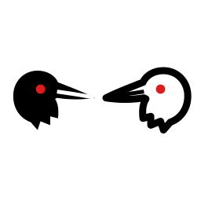

<div align="center">



# hugmunn

**A desktop client and Python library for local and cloud language models.**

Chat, tool use, and agent loops against llama.cpp on your own machine — or
against Claude and ChatGPT — with the same tools, skills and safety policy
whichever model is answering.

[](#requirements)
[](#requirements)
[](#development)
[](LICENSE)

</div>

---

Huginn and Muninn are Odin's ravens — *hugr*, thought, and *munr*, memory.
They fly out at dawn and return at dusk to report what the world is doing.

## What it is

Two things sharing one core:

**A desktop application.** A Qt window for talking to models, watching them use
tools, approving what they change, and picking up conversations where you left
them.

**A Python library.** The same agent loop, importable, so you can drive a model
from your own code without a window.

```python
import hugmunn

with hugmunn.agent("code-glm") as a:
    print(a.ask("what does this repository do?"))
```

## Why it exists

Local models are usable now, and the tooling around them mostly is not. The
gaps this closes:

- **The same interface for local and cloud.** Switching from a 27B on your own
  GPU to Claude Opus is a dropdown, not a different application. Tools, skills,
  autonomy and persistence carry across unchanged.
- **Nothing leaves the machine unless you choose it.** Local models are the
  default and the app says, every time, when a model is not one.
- **Honest numbers.** Throughput is measured on your hardware, not quoted from
  someone else's. Context usage counts the system prompt and tool schemas, not
  just the visible conversation.
- **Work that finishes.** An agent that stops after twelve tool rounds and
  reports a round count has wasted the run. This one changes strategy, steps
  back to re-canvas, and when it does run out, answers from what it found.

---

## Install

```bash
git clone git@github.com:EinarOlafsson/hugmunn.git
cd hugmunn
pip install -e .
hugmunn
```

Requires **Python 3.10+**. Local models additionally need a `llama-server`
binary — the app will build one for you on first launch, or you can point it at
an existing one.

### Requirements

| | |
|---|---|
| Python | 3.10, 3.11, 3.12 (3.13/3.14 parse cleanly but are untested) |
| GUI | PyQt6 ≥ 6.6 |
| Local models | llama.cpp; built in-app, or `LLAMA_SERVER=/path/to/llama-server` |
| Optional | `pip install -e ".[keyring]"` for encrypted API-key storage |

---

## The desktop app

### Models

24 models ship in the registry, downloadable from inside the app, grouped by
**how much alignment is left in the weights**:

| | | |
|---|---|---|
| **Stock** | as the lab shipped it | 11 models |
| **Tuned** | community tunes and standard abliterations | 3 models |
| **Unlocked** | refusal directions removed, usually via Heretic | 10 models |

The dropdown is white on black and colours only the row under the cursor —
blue, grey, red — so the list stays readable and the signal appears when you
ask for it.

Cloud models are chosen the same way. Sign in from inside the app and the list
comes from **your account**, not a hardcoded guess.

### Controls

Six tabs, because fifteen settings in one column meant scrolling past the model
picker to reach the system prompt.

**Effort** — how hard the model works within one answer. On Claude and GPT this
sets a real thinking budget; on local models it is instruction only, because
they have no such dial.

**Persistence** — how long the loop keeps going. `Light` (8 rounds) through
`Relentless` (200). Higher tiers get *more* interruption, not less: a run
allowed 200 rounds will otherwise spend them all down one wrong assumption made
in the first five. Every N rounds it is made to stop, state what it knows versus
what it assumed, and go and look at what it skipped.

**Autonomy** — what may run without asking. Four tiers from *confirm everything*
to *free anywhere except system paths and installed packages*. Editable installs
stay writable, which is what makes the top tier useful rather than merely
dangerous.

**Context** — window size per model, a usage meter that counts the system
prompt and tool schemas, and what to do when a conversation stops fitting:
refuse, drop oldest, or summarise. Trimming goes further than strictly needed,
because llama.cpp caches the prompt by prefix and trimming to exactly fit pays a
full reprocess every single turn.

**Sessions** — every conversation is saved as it happens, not on exit. Resuming
one restores the settings it ran under, not just its words: the same messages
under different settings behave differently, and the difference does not show
until an answer is wrong.

### Tools

19 built-in tools: files, shell, search, SQL, PDFs, web fetch and scraping,
PubMed and arXiv. Plus 27 skill packs — instruction sets attached per
conversation — and a plugin directory for tools you or a model write.

Anything that changes the machine goes through an approval dialog. For file
edits that dialog shows a **diff**, not the whole new file: three hundred lines
of which four differ is not something anyone reads.

Large tool results are set aside and replaced in the conversation by a digest
and a handle, with a `recall` tool to search or page through the rest. One
`read_file` on a real source file is several thousand tokens, and the model
usually wanted one function.

### Remote access

```
/remote
```

Serves a page your phone can chat from, watch tools in, and **answer approval
prompts from**. It is one conversation, not two kept in sync.

A token is always required, including on loopback, compared in constant time and
rate-limited per address. Loopback by default — reaching the machine from
elsewhere is a tunnel's job, and the reply tells you how, with Tailscale
recommended over a public URL and the reason why.

### Themes

Eight: Dark, Light, Glass, Cell, and light/dark imitations of Claude and
ChatGPT. Every palette is checked against WCAG AA on every surface a colour can
land on — a theme that fails is a test failure, not a matter of taste.

---

## The library

```python
import hugmunn

# what can this machine run?
for model in hugmunn.available_models():
    print(model.key, model.label, model.freedom)

# a local model, with tools, approving everything
with hugmunn.agent(
    "uncensored-gemma",
    tools=True,
    approve=lambda name, summary, args: True,
    persistence=hugmunn.Persistence.RELENTLESS,
    workdir="~/project",
) as a:
    for event in a.run("run the tests and fix what fails"):
        if event.kind == "content":
            print(event.text, end="", flush=True)
        elif event.kind == "tool_start":
            print(f"\n[{event.tool}: {event.summary}]")

# a cloud model, same interface
hugmunn.sign_in("claude", "sk-ant-...")
with hugmunn.agent("claude:claude-opus-5") as a:
    print(a.ask("summarise the changes in the last commit"))
```

Tools are **off** unless you ask for them, and when on, anything that changes
the machine raises `ApprovalRequired` unless you pass `approve`. A library that
runs shell commands the moment it is imported into somebody's script deserves
the review it would get.

`hugmunn.core` and `hugmunn.ui` are implementation and change without notice.
Everything in `hugmunn.__all__` keeps its meaning across a minor version.

<details>
<summary><b>Full public surface</b></summary>

| | |
|---|---|
| `Agent`, `agent` | the loop; `agent` is the context-manager form |
| `Event` | what `run()` yields — `kind`, `text`, `tool`, `summary`, `timings` |
| `Model`, `models`, `available_models` | discovery |
| `Session`, `sessions` | saved conversations |
| `Effort`, `Persistence`, `Autonomy` | the tiers |
| `skills`, `tool_names` | what can be attached |
| `sign_in`, `signed_in` | cloud credentials |
| `HugmunnError` and subclasses | everything raised deliberately |

</details>

---

## Configuration

| | |
|---|---|
| Settings | `~/.config/hugmunn/settings.json` |
| Conversations | `~/.config/hugmunn/sessions/` |
| API keys | system keyring, else a mode-600 file — never `settings.json` |
| Weights | `~/.claude/models/`, or anywhere you point it |

`HUGMUNN_CONFIG_DIR`, `HUGMUNN_MODELS_ROOT` and `LLAMA_SERVER` override these.
`ANTHROPIC_API_KEY` and `OPENAI_API_KEY` are read if set.

---

## Development

```bash
pip install -e ".[dev]"
QT_QPA_PLATFORM=offscreen pytest -q
```

**856 tests.** GUI tests build a real window offscreen and drive it — every
significant bug in this project surfaced under live use rather than from a unit
test written against its author's assumptions, so the window is constructed for
real and the controls are actually switched.

`pytest-qt` is deliberately not a dependency: it loads a Qt binding at configure
time and prefers PySide6, and two Qt bindings in one process own separate copies
of the C++ runtime. It segfaults with no Python traceback.

---

## Licence

MIT. See [LICENSE](LICENSE).

The models it downloads carry their own licences — Apache 2.0, MIT and others
depending on the model. Abliterated builds carry the licence of the model they
were derived from.
