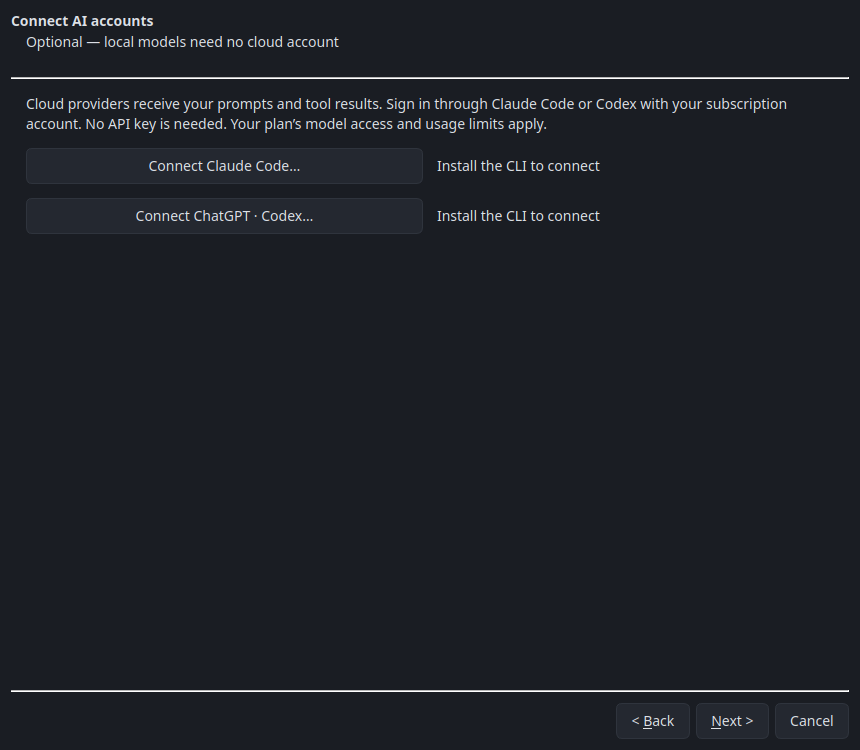

# Claude Code and Codex accounts

Hugmunn follows spaCR's approach: it starts the vendor's CLI and uses that CLI's
subscription login. Claude Code and Codex must be installed separately; the
Python wheel and desktop installers do not bundle them.

| Provider | Install/update | Sign in | Check login |
| --- | --- | --- | --- |
| Claude | [Claude Code setup](https://code.claude.com/docs/en/setup) | `claude auth login --claudeai` | `claude auth status` |
| OpenAI | [Codex CLI](https://developers.openai.com/codex/cli/) | `codex login` | `codex login status` |

In the desktop, use **Accounts → Sign in…** or the AI page in welcome setup.
The dialog provides the install link, starts browser login, and checks the
connection. Terminal login works too. Restart Hugmunn after installing a CLI
if the desktop environment has not picked up its PATH. Use current releases:
older CLIs may lack the isolation or structured-output flags Hugmunn needs.
The adapter was tested with the installed CLIs on 23 September 2026.

Choose **CLI default** for the account's current default. Claude aliases track
the models selected by Claude Code; Codex choices come from its own local model
cache. Run/update Codex, then refresh model lists if a new model is missing.
Listed models may require a different plan. Subscription limits still apply;
a limit error does not trigger an API-key fallback. Hugmunn rejects API-key
login and excludes API-key environment overrides from child processes.

## Conversations and tools

Each request sends the current conversation and enabled Hugmunn tool schemas
through the CLI's stdin. Replies arrive after the CLI finishes its structured
response; they are not streamed token by token. Hugmunn validates tool proposals
and passes them through its existing agent and approval policy. Tools remain
optional, and the Python API leaves them off by default.

Claude runs with native tools and customizations disabled. Codex runs in a
private temporary directory with a read-only sandbox, user rules/config ignored,
web search disabled, and shell, app, browser, computer, plugin and agent features
disabled. It does not run in the user's selected project directory. Hugmunn's
own approved tools supply project information. No unsafe permission-bypass
flags are used. Vendor administrator policies may still apply.

The CLI owns authentication; Hugmunn does not extract its tokens. Requests use
no-session-persistence/ephemeral mode and delete temporary request files, but
the provider's service retention and CLI diagnostic policies still apply.
Prompts and tool results are sent to that provider. Stop terminates the owned
request process, including one that is silent or waiting for the network.

## Troubleshooting

If connection checks fail, run the status command above in the same environment
that launches Hugmunn. Sign in using a subscription account, not an API key.
If a request fails, check CLI version, plan limits and model access; try **CLI
default**. Hugmunn reports failures without including raw CLI logs in automatic
GitHub issues. A model or authentication failure never silently falls back to
a directly billed API request.
