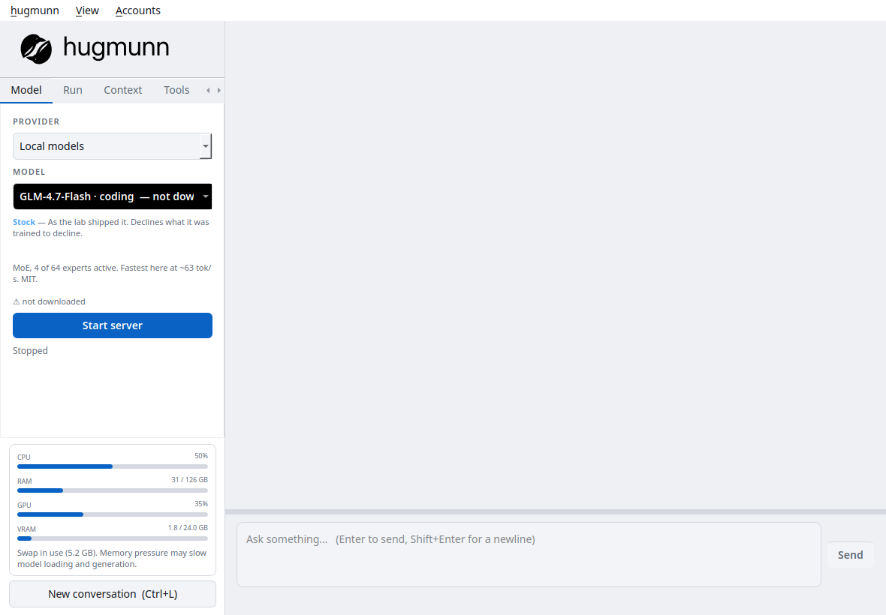

# Desktop guide

## Models and conversations

Choose a provider and model in the **Model** tab. Local entries are grouped by
registry metadata: Stock, Tuned, and Unlocked. These labels describe the
weights’ origin or modification; they do not measure quality or reliability.
Cloud entries come from a cached provider catalogue and can be refreshed from
**Accounts**.

Write in the message box and use **Ctrl+Enter** to send. **Ctrl+L** starts a new
conversation. The application saves messages as you work. Use the **Sessions**
tab or **Recent conversations** menu to reopen a conversation. Desktop sessions
restore the associated run settings as well as messages.

## Run settings

Set the working directory before enabling file or shell tools. Relative file
paths are interpreted from that directory.

| Setting | Choices and effect |
| --- | --- |
| Effort | Quick, Standard, Thorough, Exhaustive; changes instructions and supported cloud reasoning settings. Exhaustive may expose a subagent tool. |
| Persistence | Light: 8, Normal: 25, Persistent: 60, Relentless: 200 tool rounds per turn. |
| Autonomy | Controls approval decisions, as described below. |

Increasing effort or persistence can increase runtime and cloud API usage. It
does not guarantee that the model will complete a task or reach a correct
answer.

| Autonomy | Approval behavior |
| --- | --- |
| Confirm everything | Every tool call asks, including reads. |
| Ask before changing anything | Read tools run directly; writes and shell commands ask. This is the default. |
| Free inside the working directory | File changes inside the workspace can run directly; outside paths and shell/Python execution still ask. |
| Full | Most calls run directly; recognized system paths and installed-package paths still require approval. |

These checks inspect tool names and arguments. They are not a filesystem or
process sandbox. Shell commands and custom tools execute with your user’s
permissions. Cloud providers receive the output of tools you enable, including
read file contents.

The approval dialog shows the requested operation and, for supported file
changes, a diff. Rejecting a call lets the model continue without that operation.

## Context, instructions, and themes

The **Context** tab controls the model’s context window and how to handle a
conversation that no longer fits: stop, discard older messages, or summarize.
Context use includes system instructions and tool descriptions. Reducing context
can lower memory use; exceeding a model’s supported context can cause failures.

The **Tools** tab manages built-in instruction packs and custom tools. The
**System** tab edits the system prompt. Instruction packs add guidance to the
prompt; they are not executable plugins. Custom tools are Python code.

Choose a theme from **View**. The raven wordmark and window icon switch between
black and white to match the selected theme.

## Remote page

Type `/remote` to start a local browser endpoint for the active conversation.
The application prints a URL containing an access token. The page can display
responses, submit messages, and answer tool approval prompts. `/remote off`
stops the endpoint; `/remote url` prints the current address.

The service binds to loopback by default. Access from another device requires
your own tunnel or private network forwarding. Keep the token private: anyone
who can reach the endpoint with the token can interact with the conversation
and its approvals. This page is a companion to the running application, not a
separately hosted service or a versioned public HTTP API.

Type `/help` to list all available commands, including `/model`, `/theme`,
`/effort`, `/persistence`, and `/autonomy`.
