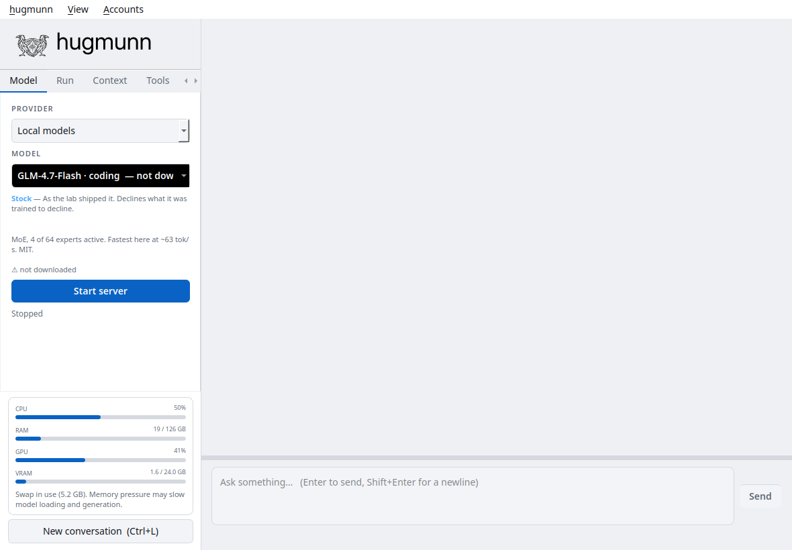

# Desktop guide

## Models and conversations

Choose a provider and model in the **Model** tab. Local entries are grouped by
registry metadata: Stock, Tuned, and Unlocked. These labels describe the
weights’ origin or modification; they do not measure quality or reliability.
Claude entries use CLI aliases; Codex entries come from its local model cache and can be refreshed from
**Accounts**.

Write in the message box and use **Ctrl+Enter** to send. **Ctrl+L** starts a new
conversation. The application saves messages as you work. Use the **Sessions**
tab or **Recent conversations** menu to reopen a conversation. Desktop sessions
restore the associated run settings as well as messages.

## Run settings

Set the working directory before enabling file or shell tools. Relative file
paths are interpreted from that directory.

| Setting | Choices and effect |
| --- | --- |
| Effort | Quick, Standard, Thorough, Exhaustive; changes instructions and supported cloud reasoning settings. Exhaustive may expose a subagent tool. |
| Persistence | Light: 8, Normal: 25, Persistent: 60, Relentless: 200 tool rounds per turn. |
| Autonomy | Controls approval decisions, as described below. |

Increasing effort or persistence can increase runtime and cloud API usage. It
does not guarantee that the model will complete a task or reach a correct
answer.

| Autonomy | Approval behavior |
| --- | --- |
| Confirm everything | Every tool call asks, including reads. |
| Ask before changing anything | Read tools run directly; writes and shell commands ask. This is the default. |
| Free inside the working directory | File changes inside the workspace can run directly; outside paths and shell/Python execution still ask. |
| Full | Most calls run directly; recognized system paths and installed-package paths still require approval. |

These checks inspect tool names and arguments. They are not a filesystem or
process sandbox. Shell commands and custom tools execute with your user’s
permissions. Cloud providers receive the output of tools you enable, including
read file contents.

The approval dialog shows the requested operation and, for supported file
changes, a diff. Rejecting a call lets the model continue without that operation.

## Context, instructions, and themes

The **Context** tab controls the model’s context window and how to handle a
conversation that no longer fits: stop, discard older messages, or summarize.
Context use includes system instructions and tool descriptions. Reducing context
can lower memory use; exceeding a model’s supported context can cause failures.

The **Tools** tab manages built-in instruction packs and custom tools. The
**System** tab edits the system prompt. Instruction packs add guidance to the
prompt; they are not executable plugins. Custom tools are Python code.

Choose a theme from **View**. The raven wordmark and window icon switch between
black and white to match the selected theme.

## Appearance

Settings → Appearance includes panel opacity (50–100%), whole-window opacity,
and rounded window chrome. Panel transparency keeps text solid; whole-window
transparency fades the entire application. Drag the empty title area to move,
double-click it to maximize/restore, and drag the edges to resize. Turn off
rounded windows to return to the operating system's title bar. Window opacity
requires desktop compositor support; Qt cannot provide desktop blur everywhere.

## Codex skills

Open **Tools → Skills → Browse and search skills**, or type `/skills`. The
catalogue includes 132 licensed skills from OpenAI's public plugin and skill
repositories, plus Hugmunn's own instruction packs. Upstream revisions and
paths are recorded in [the catalogue manifest](codex-skills-catalogue.json).
Each copied bundle retains its license, references, scripts and assets.

Use **Import installed Codex skills** to save skills from `$CODEX_HOME/skills`
(default `~/.codex/skills`), `~/.agents/skills`, and the newest locally cached
version of each Codex plugin. **Import folder** accepts other skill collections.
Copies live in the current Hugmunn profile's `skills` directory. Importing
never runs scripts, installs software, or enables a skill automatically.

Codex skills appear as short descriptions and file locations in the prompt;
the agent reads the complete `SKILL.md` only when relevant. Enable the skills
you need. Some skills require external connectors, CLIs, packages or accounts;
copying their instructions does not supply those capabilities.

## Remote page

Type `/remote`, even before loading a model. Hugmunn starts a browser endpoint
and opens the **Remote access** window with its address and login controls.
The first login uses username `hugmunn` and a generated password. Reveal/copy
that password locally and save it, or choose your own username and a password
of at least 12 characters. Passwords are hashed in `remote-auth.json`; they
never appear in conversation history, ordinary settings, or browser URLs.
If you forget the password, set a new one from `/remote setup` on the desktop.

Open the displayed URL and sign in. Browser controls include:

- Messages, live responses, Stop, and shared desktop/browser tool approvals.
- Provider/model selection and local model startup/unload.
- New, saved and restored conversations; goal and working directory.
- Effort, persistence, autonomy, reasoning, tool access and system prompt.
- Context size, skills, installed custom tools, themes and opacity.
- Foreground GPU commands, status, output and cancellation.

Account sign-in, model downloads, runtime installation and remote credentials
are configured on the desktop. Settings changes are refused while work is in
flight. A disconnected browser can reconnect without cancelling desktop work.

The default binding is `127.0.0.1:8770`. For a second device, select **Local
network** and use the host computer's LAN IP, or keep loopback and use one of
the tunnel commands shown in the dialog. Use HTTPS/private networking outside
a trusted LAN: plain HTTP does not encrypt passwords or conversation contents.
You can supply a certificate/key pair for native HTTPS or use an HTTPS tunnel.
The application must remain open. Sessions expire after 12 hours; logout,
remote restart and password changes revoke access. `/remote off` stops the
endpoint; `/remote url` shows its address.

## GPU handoff

On Linux/macOS, type `/gpu python my_gpu_task.py`, use the browser's **GPU task**
card, or let the agent call `run_gpu_task`. The command runs in the selected
working directory. Agent calls follow the same approval policy as shell
commands. The default timeout is one hour; agent calls can set 1–86400 seconds.

Hugmunn stops its owned local model process and waits for it to exit, runs the
GPU command in a separate process group, cleans up that group, then attempts
to restart the model with its exact previous launch arguments. Normal failure,
timeout and cancellation all attempt restoration. Reload failures remain
visible and leave the model stopped. Use Stop or `/gpu stop` to cancel.
Conversation state stays in memory and on disk while inference is unavailable.

Only a model started by this Hugmunn instance can be unloaded. An adopted
external model is refused; other applications' GPU processes are never killed.
Commands must run in the foreground and keep their children in the process
group. This is resource coordination, not a sandbox for untrusted commands;
it cannot reserve VRAM against unrelated programs. Windows GPU handoff is
currently unavailable because equivalent process-tree cleanup is not yet
implemented. Browser control and appearance remain available on Windows.

Type `/help` to list the commands.
