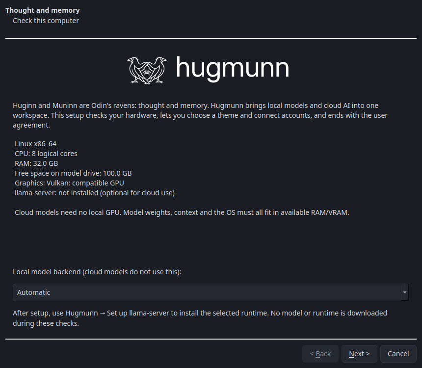

# Welcome setup and reporting

On first launch, Hugmunn opens five pages:

1. **Hardware:** local CPU/RAM/disk/graphics checks and a local backend choice.
2. **Theme:** a live preview of every theme, including system light/dark mode.
3. **AI accounts:** optional Claude Code and Codex subscription login. Local
   inference needs no cloud account. The vendor CLI owns authentication; install
   links, browser sign-in and connection checks are provided.
4. **GitHub:** optional browser sign-in through GitHub CLI (`gh`), or connection
   to an existing CLI account. Install links are provided when `gh` is missing.
5. **User agreement:** the full PolyForm Noncommercial license, reporting
   disclosure, reporting preference and an initially unchecked acceptance box.

Canceling does not record acceptance. Signing in to an account before canceling
still leaves that account with its credential store. Completing setup records
the agreement version and acceptance time; revised agreements appear again.
`--help`, `--version`, package imports and installer smoke tests do not open setup.
The Python API does not show a GUI agreement or automatically send reports.

Revisit setup from **hugmunn → Welcome and setup…**. **Accounts → Connect GitHub
for reports…** opens the account step directly. Disconnecting reporting leaves
GitHub CLI's login intact. Reconnecting is required if the CLI account changes.

## What automatic reports contain

Reports are public issues in `EinarOlafsson/hugmunn` and use the connected user's
GitHub identity. Automatic reporting is enabled by default, but nothing is sent
until the current agreement is accepted and an account is connected. The setting
can be turned off at any time in setup or Accounts.

Each report contains the Hugmunn version, OS family, Python version and a fixed
error category. Unexpected exceptions may include a built-in exception type and
Hugmunn module/line locations. Custom exception names are replaced with
`Exception`. Reports deliberately omit exception messages, stack source text,
local variables, raw logs, prompts, conversations, paths, file contents, model
names, hardware identifiers and keys. GitHub makes the issue author's username
public. Hardware checks are not sent.

A fingerprint deduplicates reports locally and against the latest 100 repository
issues. At most three distinct reports are sent per day per configuration
folder. Reporting is best-effort: network/authentication failures are ignored,
no raw report backlog is retained, and the app continues. Tests disable live
GitHub requests and use mocked transports; testing never opens real issues.

The application catches ordinary Python/Qt callback exceptions and reports
model request/start/download failure categories. Native crashes, forced process
termination and errors before startup may not produce a report. You can always
[file an issue manually](https://github.com/EinarOlafsson/hugmunn/issues/new).
