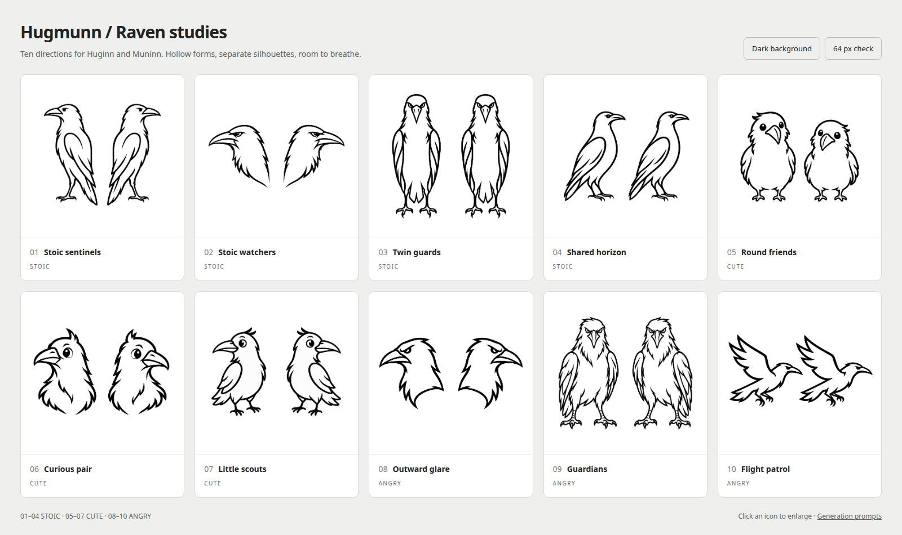

# Hugmunn icon archive

## Active logo — Omniscience

The selected application logo is **11 — Omniscience**: two outward-looking
ravens beneath a radiant all-seeing eye.

<picture>
  <source media="(prefers-color-scheme: dark)" srcset="../src/hugmunn/resources/icons/hugmunn-mark-white.svg">
  
</picture>

[Original PNG](11-omniscience.png) · [Generation prompt](omniscience-prompt.txt)

## First ten studies

Ten alternatives for Hugmunn, with space between Huginn and Muninn and three
different expressions. Every option uses hollow forms and two separate birds.

Open [the interactive gallery](index.html) locally to enlarge an option, switch
between light and dark backgrounds, or compare the designs at 64 pixels.
The [dark comparison sheet](preview-dark.png) shows the inverted artwork.

| Option | Expression | Composition | Original image |
| --- | --- | --- | --- |
| 01 — Stoic sentinels | Stoic | Tall, upright ravens looking outward | [PNG](01-stoic-sentinels.png) |
| 02 — Stoic watchers | Stoic | Two outward-facing head profiles | [PNG](02-stoic-watchers.png) |
| 03 — Twin guards | Stoic | Two front-facing, upright birds | [PNG](03-stoic-twin-guards.png) |
| 04 — Shared horizon | Stoic | Both birds looking in the same direction | [PNG](04-stoic-shared-horizon.png) |
| 05 — Round friends | Cute | Rounded bodies and friendly eyes | [PNG](05-cute-round-friends.png) |
| 06 — Curious pair | Cute | Head-and-shoulder portraits with curious tilts | [PNG](06-cute-curious-pair.png) |
| 07 — Little scouts | Cute | Small, alert birds with feather tufts | [PNG](07-cute-little-scouts.png) |
| 08 — Outward glare | Angry | Angular profiles with a fierce expression | [PNG](08-angry-outward-glare.png) |
| 09 — Guardians | Angry | Broad-shouldered, front-facing ravens | [PNG](09-angry-guardians.png) |
| 10 — Flight patrol | Angry | Two separate birds in flight | [PNG](10-angry-flight-patrol.png) |

The ten original PNGs were generated with the built-in image-generation tool.
They retain their transparency and original resolution. The gallery uses CSS
to preview white outlines on black; the comparison sheets are browser captures
of that gallery. The exact prompt for each option is in [prompts.json](prompts.json).

## Selected artwork

The original omniscience PNG is preserved. Its contours were traced into scalable black and white
SVGs in [`src/hugmunn/resources/icons/`](../src/hugmunn/resources/icons/).
The same mark is used in the wordmark, remote page, and native icon formats.

For this conversion, ImageMagick flattened the original onto white and made
a 50% threshold PBM; Potrace 1.16 traced it with `--turdsize 4 --opttolerance 0.2`.
The SVGs retain the hollow interiors. Run `python packaging/generate_icons.py`
to regenerate the PNG, ICO, and ICNS files from the packaged SVGs.

Previous production artwork is preserved in
[`archive/circling-ravens/`](archive/circling-ravens/) and
[`archive/stoic-sentinels/`](archive/stoic-sentinels/).
