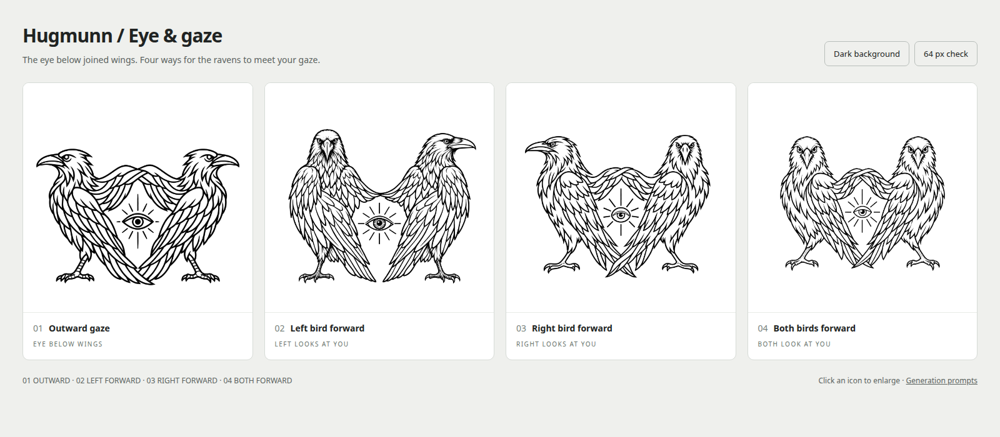

# Eye placement and gaze

**Selected for the application: 01 — Outward gaze.**

Four refinements of the selected woven-wing concept. The symbolic eye moves
into the space between the birds, beneath their joined inner wings.

[Dark comparison](preview-dark.png) · [Interactive gallery](index.html)

| Option | Gaze | Original PNG |
| --- | --- | --- |
| 01 | Both birds look outward | [PNG](01-outward-gaze.png) |
| 02 | The left bird looks at the viewer | [PNG](02-left-bird-forward.png) |
| 03 | The right bird looks at the viewer | [PNG](03-right-bird-forward.png) |
| 04 | Both birds look at the viewer | [PNG](04-both-birds-forward.png) |

Generated with the built-in image-generation tool, using the user-supplied
woven-wing image as the edit target. The original PNGs and exact
[prompts](prompts.json) are preserved. Dark previews use CSS inversion.
