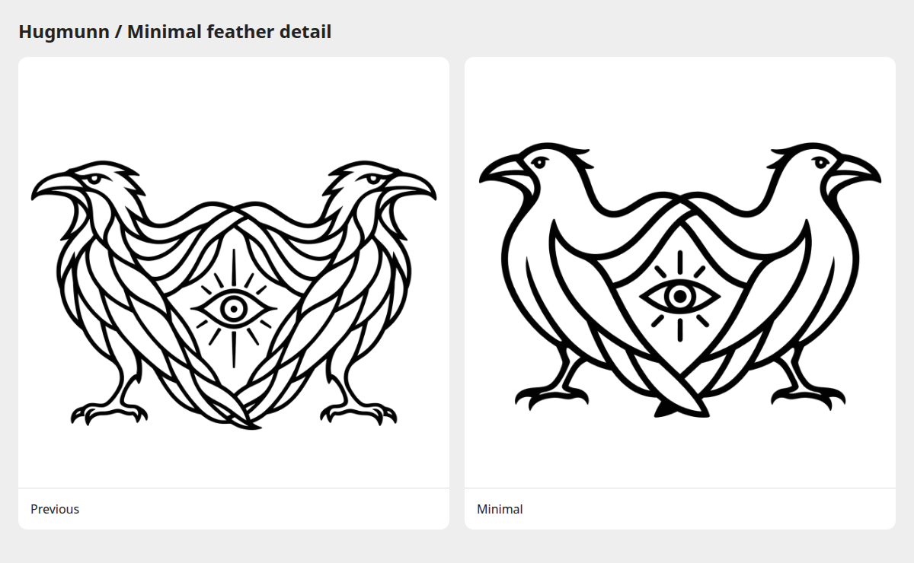

# Minimal joined-wing ravens

The active icon emphasizes the three essential traits requested by the owner:
raven heads, the all-seeing eye, and the ravens holding their wings around it.
Open chests and necks replace small feather lines; the wings retain only a few
broad divisions. Both birds continue looking outward.

[Original PNG](joined-wings.png) · [Dark comparison](preview-dark.png) ·
[Comparison page](index.html) · [Exact edit prompt](prompt.txt)

Created with the built-in image-generation tool using the
[first simplification](../simplified/joined-wings.png) as the edit target.
Originals retain their transparency. Comparison sheets are browser captures;
the dark preview uses CSS inversion.

Previous packaged artwork is in
[`archive/joined-wings-simplified/`](../archive/joined-wings-simplified/).
The active vectors and native icons are in
[`src/hugmunn/resources/icons/`](../../src/hugmunn/resources/icons/).
