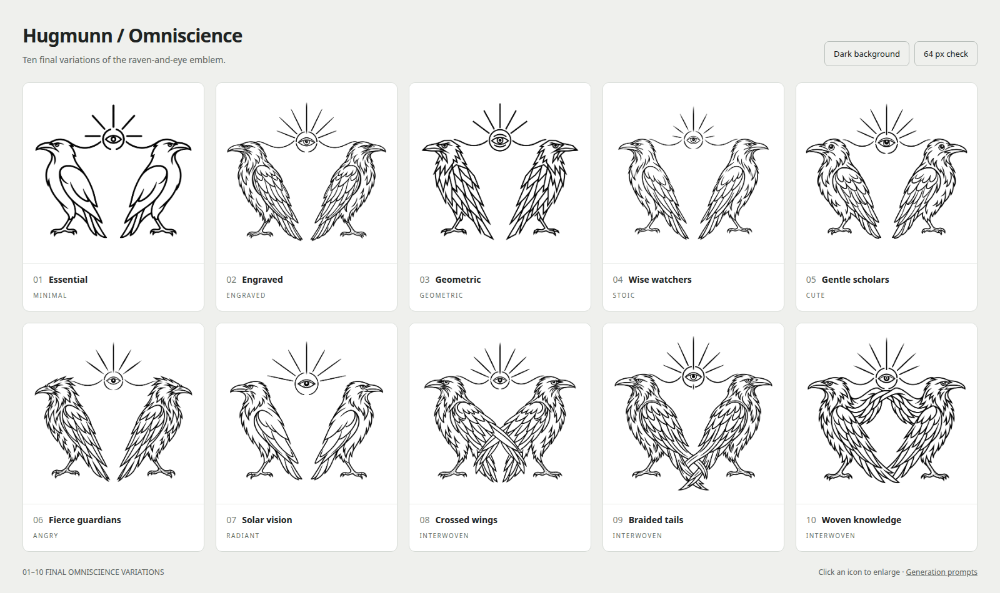

# Final omniscience variations

Ten variations of the selected [omniscience logo](../11-omniscience.png),
each retaining the outward-looking raven pair and the central all-seeing eye.

[Dark comparison sheet](preview-dark.png) · [Interactive gallery](index.html)

Open the gallery locally to enlarge each image, switch backgrounds, and check
how the mark reads at 64 pixels.

| Option | Treatment | Original PNG |
| --- | --- | --- |
| 01 | Essential — reduced feather detail and stronger lines | [PNG](01-essential.png) |
| 02 | Engraved — restrained layered feathers | [PNG](02-engraved.png) |
| 03 | Geometric — angular forms and precise symmetry | [PNG](03-geometric.png) |
| 04 | Wise watchers — calm, stoic expressions | [PNG](04-wise-watchers.png) |
| 05 | Gentle scholars — rounder, friendlier ravens | [PNG](05-gentle-scholars.png) |
| 06 | Fierce guardians — sharper eyes and feather contours | [PNG](06-fierce-guardians.png) |
| 07 | Solar vision — a more luminous eye and halo | [PNG](07-solar-vision.png) |
| 08 | Crossed wings — inner wings woven into an open X | [PNG](08-crossed-wings.png) |
| 09 | Braided tails — tail feathers forming an interlaced loop | [PNG](09-braided-tails.png) |
| 10 | Woven knowledge — inner wings forming a shared arch | [PNG](10-woven-knowledge.png) |

Generated with the built-in image-generation tool using the selected logo as
the reference. All original PNGs and exact [prompts](prompts.json) are preserved.
Dark previews use CSS inversion; comparison sheets are browser captures.

Options 08–10 explore intertwined wings or tails with upright, outward-looking
heads. Two earlier separate-bird alternatives are preserved in
[`alternates/`](alternates/), together with their prompts.

The active application artwork is the later refinement,
[minimal joined-wing design](../README.md#active-logo--joined-wings), with
the eye below the joined wings.
