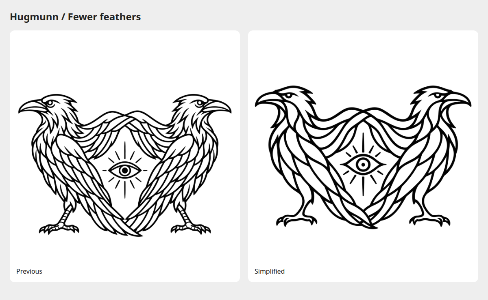

# Simplified joined-wing ravens

The active logo retains the selected outward-looking ravens, their joined
wings, and the eye below them. Larger hollow shapes and fewer feather lines
make the mark easier to read at small sizes.

[Original PNG](joined-wings.png) · [Dark comparison](preview-dark.png) ·
[Comparison page](index.html) · [Exact edit prompt](prompt.txt)

Created with the built-in image-generation tool using
[`01 — Outward gaze`](../gaze-studies/01-outward-gaze.png) as the edit target.
The original PNG is preserved without modification. Comparison sheets are
browser captures; the dark preview uses CSS inversion.

The earlier packaged artwork remains in
[`archive/joined-wings-detailed/`](../archive/joined-wings-detailed/).
The active black and white SVGs and native formats are in
[`src/hugmunn/resources/icons/`](../../src/hugmunn/resources/icons/).
